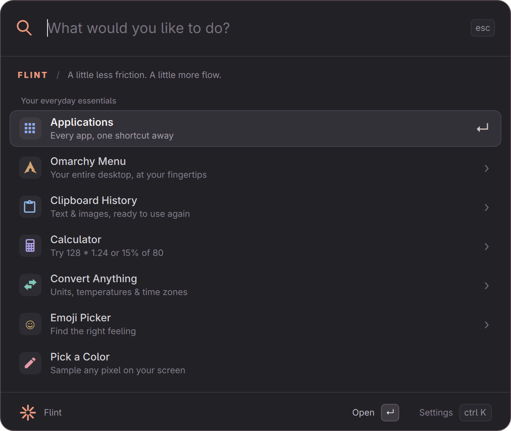

# Flint

A Raycast-inspired command palette for Omarchy 4. A review prototype: native QML UI, keyboard navigation, and nine capability extensions.



## Review it

From this checkout:

```sh
./bin/flint
./bin/flint open '2m in feet'
./bin/flint settings
```

The review launcher runs a separate Quickshell configuration. It does **not** install Flint, change keybindings, or replace the current menu. Use `./bin/flint stop` to terminate the review instance.

Production integration is an **Omarchy menu plugin**: `manifest.json` declares `entryPoints.menu: Flint.qml` and `omarchy.clonedFrom: omarchy.menu`. Omarchy's existing shell can host it and route menu calls to it. The separate `shell.qml` is a development harness only. Live installation, replacement, disable/restore, and shell-restart testing remain to be done after the architecture review.

Requirements already available on the development machine: Omarchy 4, Quickshell 0.3, Qt 6.11, Python 3.11+, `wl-copy`, `hyprpicker`, `gtk-launch`, and Omarchy's launch helpers. No pip/npm dependencies or build step.

## What works

| Extension | Try it |
| --- | --- |
| Applications | Search an app by name, or open Applications |
| Omarchy | Browse the live menu, or search `nightlight`, `theme`, `screenshot` |
| Calculator | `sqrt(144) + 15% of 80`, `128 * 1.24` |
| Converter | `2m in feet`, `32 F to C`, `1 GiB in MiB` |
| Time zones | `10 am in London`, `11 pm in New York to Tokyo on 2026-09-06` |
| Clipboard | Open Clipboard History; text and images use Omarchy's existing history |
| Emoji | `:smile`, `:rocket`, or open Emoji Picker |
| Colors | `#ff6644` for HEX/RGB/HSL, or Pick a Color |
| AI and web | An unmatched query offers Google, ChatGPT and Claude |
| Settings | `Ctrl+,`; change extension settings or open the config file |

Time conversion interprets `10 am in London` as 10:00 **in London**, converted to your configured local zone, on today's date in London. The example config uses Europe/Tallinn. DST gaps and repeated times are rejected instead of guessed. Gallons are US liquid gallons; KB/MB/GB are decimal and KiB/MiB/GiB are binary. Currency and broad natural-language parsing are not implemented.

`↑`/`↓` or `Ctrl+P`/`Ctrl+N` select; `Enter` activates; **Escape closes immediately**. Left Arrow or Backspace goes back when the search field is empty; Left Arrow otherwise edits text normally. Every submenu and back-navigation starts at the first row. `Ctrl+K` opens the selected extension's settings. Destructive menu actions have a confirmation step (`Ctrl+Enter` or the Confirm button).

The default **Compact** layout is 640 logical pixels wide with shorter rows. Change it at **Flint Settings → Appearance → Layout density**; Comfortable is 760 pixels wide. Both adapt to smaller screens. The search icon is drawn geometrically and the header labels share a text baseline.

Typing keeps the existing rows in place while the next results arrive. Fast providers are coalesced into one update; a loading hint only appears after 180 ms. Bare numbers such as `22` show a calculator result; an unfinished expression such as `22 +` keeps a non-actionable calculator preview until the next operand is entered.

Strong application-name matches rank ahead of menu configuration commands. App and Omarchy command selections learn a **frecency** bonus: frequency weighted by recency, halving every 14 days. Learning starts with selections made by this version. The score is bounded and cannot promote unrelated matches or outrank computed answers. `~/.local/state/flint/usage.json` (respecting `XDG_STATE_HOME`, or `FLINT_USAGE` for tests) contains hashed result IDs, decaying weights and timestamps; no query text, prompts or clipboard contents are recorded. A dispatch counts as a selection, even if the external application subsequently fails to start.

The host uses Omarchy's actual menu definitions, including user JSONC overrides, aliases, links, conditions and dynamic font/power-profile providers. The inspected stock definition contains **320 entries and 263 actions**. Those actions were indexed, not all executed. Direct leaf routes currently display the command for explicit activation instead of executing on summon. Caller-specified dmenu width/height is currently normalized to Flint's card size.

## AI behavior

- **Desktop:** copy the prompt and open the app. Claude's installed desktop entry advertises a New Chat link, which Flint uses. ChatGPT currently opens the app; choose New chat and paste. Automatic prompt insertion or submission is not implemented.
- **CLI:** open an interactive Codex or Claude session with the prompt as a literal argument. Normal CLI permissions remain in effect.
- **Browser:** copy the prompt and open the provider's conversation page.
- Google opens the default browser with a URL-encoded query.

Selecting an AI action is required. Typing does not send queries to a provider. Desktop/CLI launches have not been exercised end to end; inspect the configured mode before using them. Desktop mode requires the appropriate app executable on PATH.

## Configuration

Flint reads `~/.config/flint/config.json` (or `$XDG_CONFIG_HOME/flint/config.json`). `FLINT_CONFIG` overrides the path for testing. Missing keys take the extension defaults. [config.example.json](config.example.json) includes every setting.

The settings screens are generated from each extension's manifest. Writes preserve unknown fields and use an atomic replacement with mode 0600. Invalid config files are reported and not overwritten. Config edits are picked up at the next query/open; extension discovery currently requires restarting Flint.

## Architecture is under review

This build uses a resident Python process for query orchestration, arithmetic, time zones, and a language-independent external-extension protocol. That was an early implementation choice, **not a requirement of QML or Omarchy**. QML already embeds JavaScript in Qt.

The proposed next direction is an Omarchy-native menu clone with QML/JS capability modules and community extensions distributed as ordinary Omarchy plugins. Keep this implementation as a visual and behavioral reference while deciding the integration contract. See [architecture.md](docs/architecture.md).

[Fable's review handoff](docs/fable-review.md) collects the deliberations, performance evidence, open decisions and a ready-to-use review prompt. Further fuzzy-matching work is deferred until the architecture is settled.

The prototype's external protocol is documented in [extensions.md](docs/extensions.md); it is experimental, not the planned public ecosystem contract.

## Verification

```sh
python -m unittest discover -s tests -v
omarchy plugin validate "$PWD"
./bin/flint open
python tests/ui_smoke.py
```

The UI smoke test operates only this review instance, opens several views, and writes temporary picker replies. It closes the palette afterward. It does not execute menu actions, launch AI sessions, or modify desktop configuration.

See [verification.md](docs/verification.md) for test results, measurements, and remaining integration work. This is not yet a production-complete menu replacement.
