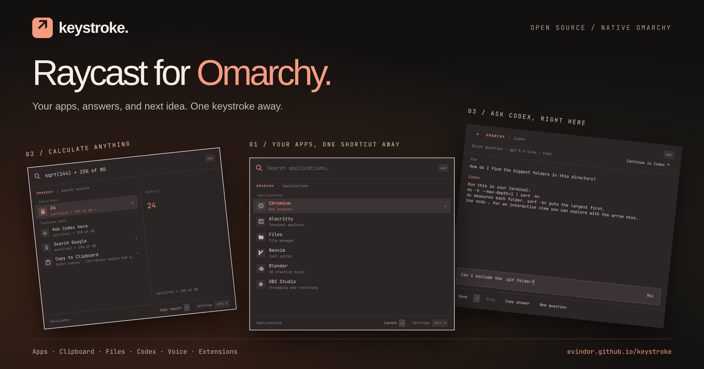
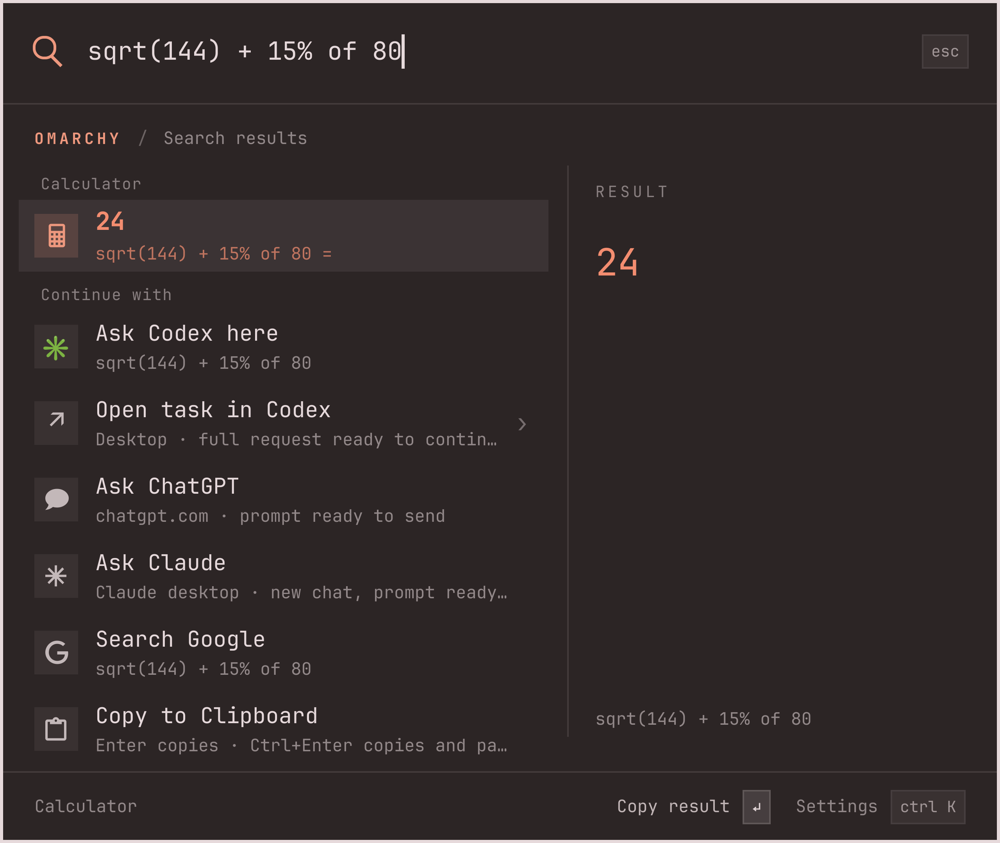
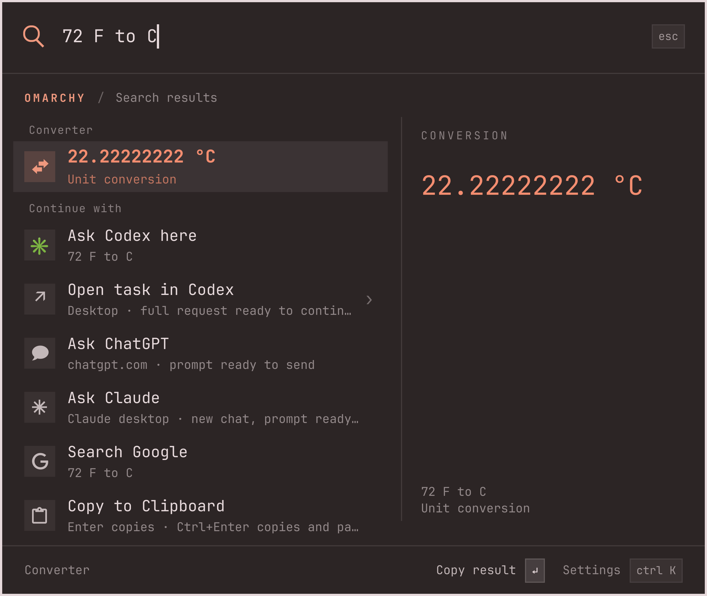
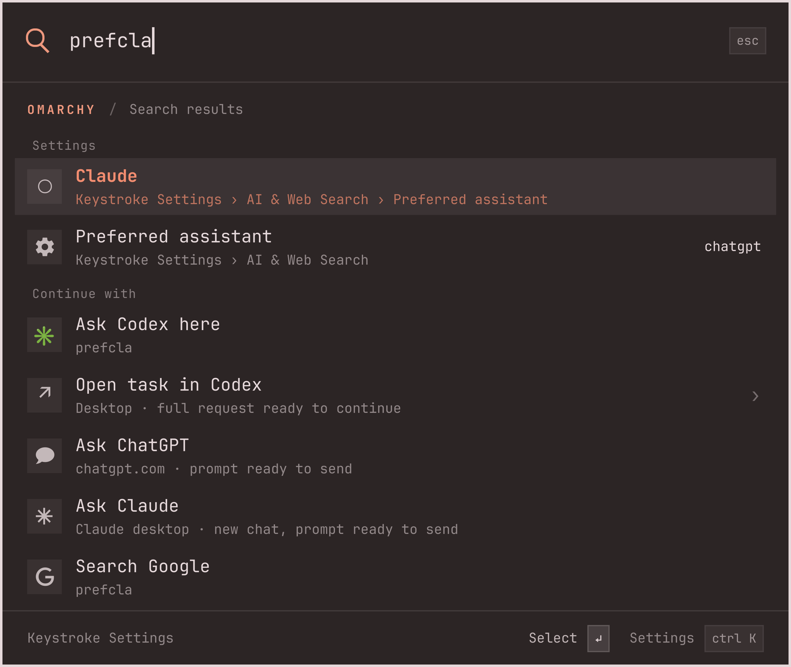
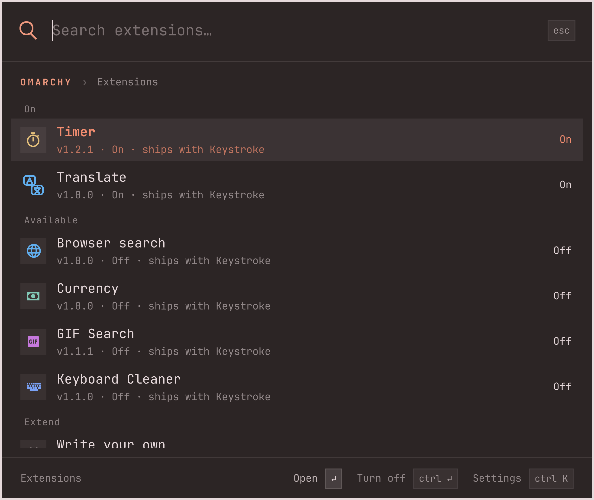
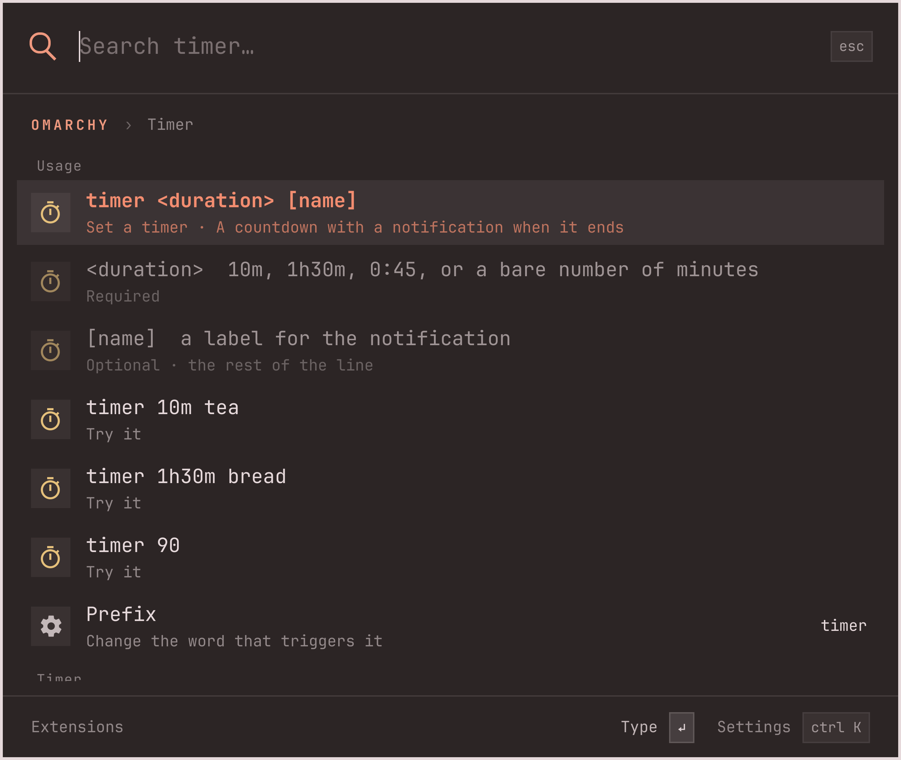
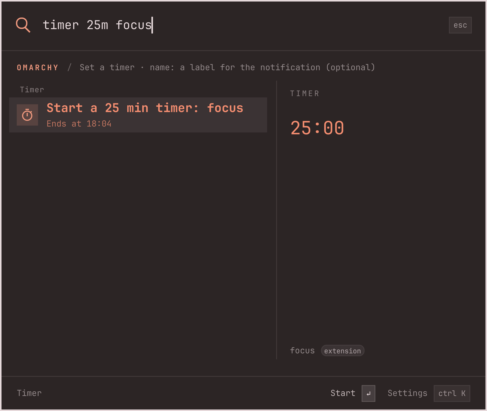
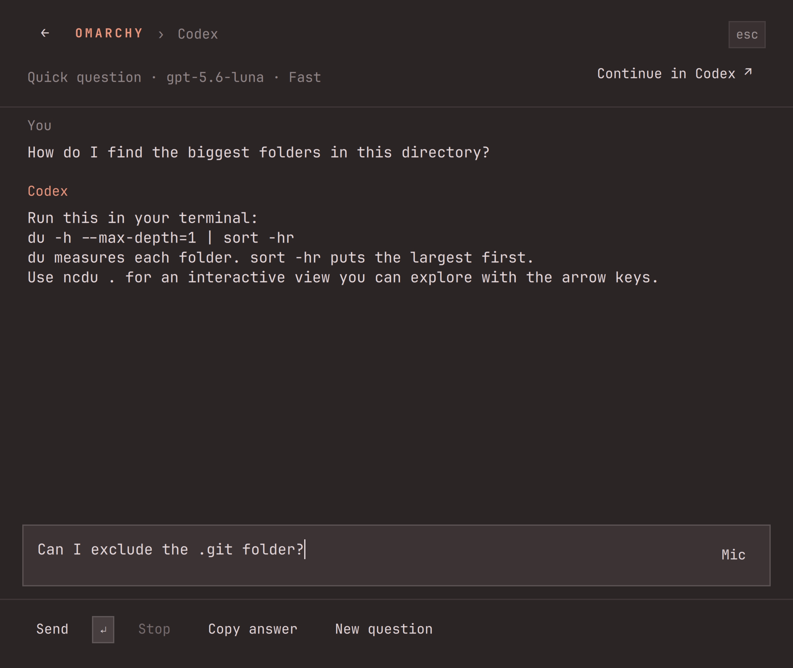
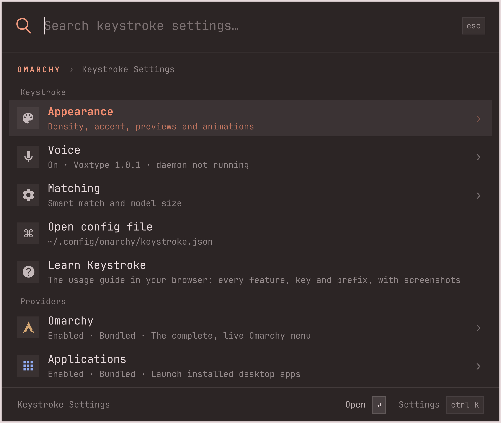

# Keystroke

A Raycast-style command palette that **replaces the Omarchy menu**. One native Omarchy `menu` plugin in QML and JavaScript, running inside the existing `omarchy-shell` process, themed by whatever Omarchy theme is active. Type, or speak, what you want: apps, the whole Omarchy menu, calculations, conversions, colors, emoji, clipboard history, files, Codex, and anything an extension adds. Smart Match, a small embedding model running locally, understands what you mean when the words do not match exactly.

<p align="center"><a href="https://evindor.github.io/keystroke/"></a></p>

**[Explore the feature showcase and installation guide →](https://evindor.github.io/keystroke/)**

[Release notes: 1.3.0](docs/releases/v1.3.0.md) — extensions work again: Keystroke loads them itself, since omarchy-shell shows a plugin only its own manifest and service. Earlier: [1.2.1](docs/releases/v1.2.1.md), [1.2.0](docs/releases/v1.2.0.md).

Screenshots show the real Omarchy interface with public demo data.

## Install

```sh
omarchy plugin add https://github.com/evindor/keystroke.git --enable
```

That is all. Enabling Keystroke makes it the menu: `Super+Space`, every `omarchy-menu` binding, `omarchy menu summon <route>`, and the `omarchy-menu-select`/`omarchy-menu-input` pickers all route to it. Disabling or removing it (`omarchy plugin disable evindor.keystroke`, `omarchy plugin remove evindor.keystroke`) restores the stock menu. This works because the manifest declares `omarchy.clonedFrom: "omarchy.menu"`; Omarchy's plugin registry routes calls for `omarchy.menu` to the enabled replacement and restores the original afterwards. The plugin id `evindor.keystroke` is permanent.

From a checkout, `bin/keystroke install` copies the tree into `~/.config/omarchy/plugins/evindor.keystroke` (no symlinks) and enables it; `bin/keystroke uninstall` reverses that.

Smart Match defaults to **Voice and text** with the small **2M** embedding model.
The first matching query fetches the model (8 MB, pinned digest) and starts the
compiled engine shipped with the plugin (a static x86_64 binary; 16 MiB resident,
ready in tens of milliseconds). On another architecture `cargo` builds it once from
the included source, and without a Rust toolchain Python 3 with `uv` installs the
equivalent pinned runtime instead. Ordinary search remains available
during setup; checkout installation prepares everything ahead of time. After
setup, matching works offline.

**Bar-widget note (Omarchy 4.0.x).** Keystroke also ships the menu button as a bar widget, so enabling it puts a button in your bar (replacing the stock one in place if you had it). For a third-party plugin, "enabled" means "referenced in shell.json", so removing that button from the bar also disables the menu. If you do not want the button, keep the plugin listed under `plugins[]` in `~/.config/omarchy/shell.json` instead.

Requires Omarchy ≥ 4.0.2 (Quickshell 0.3, Qt 6.11). Like every Omarchy plugin, Keystroke runs unsandboxed inside your shell with your permissions; the code is here to read.

## What it does

<table>
<tr>
<td></td>
<td></td>
</tr>
<tr>
<td></td>
<td></td>
</tr>
</table>

- **Type anything**: apps, Omarchy commands, `sqrt(144) + 15% of 80`, `2m in feet`, `32 F to C`, `10am pt`, `10 am in London`, `now in tokyo`, `#ff6644`, `:smile`, `readme`, `timer 10m tea`.
- **Fuzzy everywhere, into submenus.** From the root, `prefp`, `keysepro` and `setaiprv` all land on Keystroke Settings › AI & Web Search › Preferred assistant, `prefcla` on its Claude choice, `sysshut` on System › Shutdown. Letters may skip whole words of the breadcrumb, words can come in any order (`ai prov`), descriptions match by word. Inside a submenu the same search covers everything below it.
- **Answers first.** Computed results appear as answer rows with a preview; matches next; Google and the assistants last.
- **Files and folders** under `~` join the results from two characters on. Fuzzy abbreviations work: `dwnlds` finds Downloads, and `~dcmnts rpt` searches only files and folders for reports under Documents. `~` always selects fuzzy file search; Settings → Files → **Search in the main palette** offers **Fuzzy** (default), **Literal**, or **Only with ~**. Hidden entries are optional; gitignore rules remain respected. `↵` opens the result; `Ctrl+↵` opens a terminal there. At most ten results mix into the main palette; `~` and the Files screen show up to sixty.
- **Hotkeys you have not learned yet.** Every Omarchy keybinding is a row at the root, named by what it does, with the keys next to it: `flcrn` shows **Full screen** with `Super + F`, `super f` finds the same bind by its keys, `screenshot` finds the one that runs `omarchy-capture-screenshot`. `↵` runs the bind exactly as pressing it would (the list and the dispatch both come from `omarchy-menu-keybindings`, the script behind `Super+K`); the keys shown are the suggestion for next time, and frecency lifts what you actually use. The **Hotkeys** screen lists all of them in the `Super+K` order. Binds Omarchy cannot run from a menu (Lua closures such as **Close window**) are shown greyed so the keys can still be learned. At most ten mix into the root (Settings → Hotkeys).
- **Assistant hand-offs** open the target with your prompt already in its composer, nothing goes through the clipboard: Claude desktop via `claude://claude.ai/new?q=…`, the Codex desktop app via `codex://threads/new?prompt=…`, or the browser (`claude.ai/new?q=`, `chatgpt.com/?prompt=`; `?q=` sends immediately when **Send immediately in the browser** is on). CLI mode opens a terminal with `claude` or `codex` and the prompt as a literal argument.
- **Keys**: `↑`/`↓` or `Ctrl+P`/`Ctrl+N` move, `PageUp`/`PageDown` jump six rows, `↵` or `→` activates, `Ctrl+1`…`Ctrl+8` activate the first to eighth result directly (holding `Ctrl` shows each row's number in place of its icon), `Ctrl+↵` runs a row's alternate action, `Esc` closes, `Ctrl+U` clears the query, `←`/`Backspace` on an empty query goes back, `Del` on an application offers to uninstall it, `Ctrl+,` opens Settings, `Ctrl+K` opens the selected provider's settings.
- **Destructive Omarchy actions** (shutdown, reboot, logout, hibernate, removals, config resets) ask for confirmation; turn this off in Settings → Omarchy.
- **Frecency and learned preferences.** Selections of apps, Omarchy commands and hotkeys earn a bounded bonus (14-day half-life), and choosing a result for a query lifts that result the next time the same query is typed or spoken in the same scope. State lives in `~/.local/state/keystroke/usage.json` as hashed ids only, never as query text.
- **Every `omarchy menu` route works as before**: submenus open scoped (`omarchy menu toggle system`), leaf aliases run immediately (`omarchy menu summon reminder-set`), `apps` opens the Applications provider. Pickers honor `width`/`maxHeight`; a new picker request cancels a pending one.

## Smart Match

**Keystroke Settings > Matching** contains:

- **Smart match** — “Match queries using an embedding model”: **Off** (model
  unloaded), **Only voice**, or **Voice and text** (default).
- **Matching model** — **Small (2M)** (default) or **Large (8M)**. Large downloads
  once when first used; switching Off releases the model but keeps its files.

Smart Match supplements exact and fuzzy search with action descriptions and local
semantic suggestions. It keeps launch/install/remove and start/stop distinct,
recognizes small typos, and offers Chromium for “launch Chrome” when Chrome is
absent. Spoken arithmetic such as “27 plus 90” becomes `27 + 90`; dictation and
assistant prompts retain the original transcript. Results still require Enter and
keep their existing confirmations. Ambiguous speech can still need correction.

Both models run locally on CPU. The runtime unloads after two idle minutes, and a
setup failure leaves ordinary matching available. Use **Retry Smart Match** in the
Matching settings screen or `bin/keystroke matching` to retry installation. Runtime
files live under `~/.local/share/keystroke/matching` (or `XDG_DATA_HOME`). More detail
is in [the matching runtime documentation](matching/README.md).

## Extensions

Third-party extensions live inside Keystroke itself, one folder each under [extensions/](extensions/), the way the [Raycast extensions repository](https://github.com/raycast/extensions) works: anyone adds a folder, opens a pull request, and once it is reviewed and merged the extension reaches every user with the next Keystroke update. The bundled providers in `providers/` are the vetted core; `extensions/` is where the community adds theirs.

<p align="center"></p>

**Every extension is off until you turn it on.** Installing or updating Keystroke never runs code from `extensions/`: an extension that is off is not even compiled. Type `ext` and open **Extensions**:

- The list shows every extension with its version and state. `↵` opens its screen; `Ctrl+↵` on a row that is on turns it off.
- **Enabled** on an extension's screen asks for confirmation, states the folder whose code will run in your shell with your permissions, and then loads it at once. Turning it off destroys its service. One that failed to load shows **Needs attention** with the QML error.
- **Run setup** appears only for an extension that declares a setup script (a model to download, something to build). It opens a visible terminal and runs the script in front of you; nothing runs on its own.
- **Settings** opens the extension's settings screen; **Open source** opens its folder on GitHub.
- **Write your own** points at the guide. A folder in `~/.local/share/keystroke/extensions/` is picked up next time the palette opens, so you can use an extension you are writing before, or instead of, sending it upstream.

**Write one.** An extension is a folder with an `extension.json` (name, version, description, icon, `apiVersion`) and a `Service.qml` exposing a `provider` object with `query(ctx)`. It can declare the shapes of text it answers as **patterns** (regular expressions with a boost: `price = 10` lifts Calpad's offer above the assistant hand-offs without Calpad knowing about them), carry its own **image icon** on every row about it, and ship a **view** of its own over the palette card. The reference is [extensions/timer](extensions/timer/): countdown timers with settings, a scoped screen, a service that outlives the palette and unit tests, small enough to read in one sitting. The contract is [docs/providers.md](docs/providers.md); the step-by-step guide for people and coding agents, from the first folder to the pull request, is [CONTRIBUTING.md](CONTRIBUTING.md#build-an-extension).

<p align="center"></p>

## Voice

Keystroke dictates through [voxtype](https://voxtype.io), the optional dictation daemon Omarchy installs from Install › AI › Dictation. Keystroke Settings › Voice shows **Voxtype voice command integration**, on by default as soon as `voxtype` is on the `PATH`, and offers Omarchy's installer when it is not. Keystroke uses that ordinary installation as-is: it does not install a fork, replace the user service, or edit `~/.config/voxtype/config.toml`. Model, language, audio, VAD and output preferences remain entirely under `voxtype configure`.

Two ways in, both while the palette is open:

- **Tap the hotkey again.** The second tap of `Super+Space` starts listening instead of closing the palette; a third tap stops. Set **Second tap of the hotkey** to *Close* to keep the stock toggle.
- **Hold the hotkey.** Keep `Super+Space` down: after Hyprland's key-repeat delay the palette starts listening, and releasing the chord stops it. This needs a long-press bind and a release bind on the same key; Settings › Voice › **Hold-to-talk bindings** writes them into `~/.config/hypr/bindings.lua` inside a marked block (confirmation first, then `hyprctl reload`). The block is plain Lua you can also paste yourself:

  ```lua
  -- >>> keystroke voice: hold the palette hotkey to dictate (written by Keystroke Settings › Voice)
  o.bind("SUPER + SPACE", nil, "omarchy-shell shell call omarchy.menu voiceHold '{}'", { long_press = true })
  o.bind("SUPER + SPACE", nil, "omarchy-shell shell call omarchy.menu voiceRelease '{}'", { release = true })
  -- <<< keystroke voice
  ```

While listening, a small waveform sits to the right. Releasing the hotkey, tapping it again, or pressing `↵` finishes the recording; the completed transcript then fills the query and a fresh `↵` runs the visible selection. Typing or navigating cancels the recording. Voxtype's overlay is hidden for Keystroke's one recording only, the transcript never goes through the clipboard or a virtual keyboard, and temporary transcript files are removed afterwards. If a future Voxtype release publishes live partials for file-output integrations, Keystroke already watches its runtime mirror and will update matches as the words arrive. Trailing punctuation, a leading launcher verb ("open", "go to") and filler are dropped before matching, so "Launch Chrome." is searched as `Chrome`.

**Copy to Clipboard** appears under **Continue with** after any spoken or typed query: `↵` copies the original text and closes, `Ctrl+↵` copies, closes and pastes into the previous window. The separate **Dictate to Clipboard** launcher (`bin/keystroke dictate`) starts a prose-only recording with the same keys.

Keystroke passes only per-recording `--file` and `--no-osd` overrides. With the daemon stopped the palette says so instead of listening.

## Codex inside Keystroke

<p align="center"></p>

Type or speak, then select **Ask Codex here**, or type `? ` before your question. Answers stream inside the palette. `↵` sends a follow-up, `Shift+↵` adds a line, your voice hotkey fills the composer, **Stop** interrupts, `Esc` closes. **Codex → Recent questions** continues a conversation; **Continue in Codex** (`Ctrl+↵`) hands it to your desktop app or CLI; **Open task in Codex** opens a new request there. Settings → Codex selects the model, Fast/Standard processing, destination and an optional working folder; the default is GPT-5.6 Luna using your existing `codex login`. Keystroke owns one local `codex app-server` process, shuts it down after ten idle minutes, never reads credentials, and stores only its recent-question index and drafts. This integration pins Codex CLI 0.153.2. Details and limits: [docs/codex-integration-verification.md](docs/codex-integration-verification.md).

## Settings

<p align="center"></p>

One file, hand-editable and hot-reloaded: `~/.config/omarchy/keystroke.json` (see [keystroke.example.json](keystroke.example.json)). Settings screens are generated from each provider's schema; writes are atomic, preserve unknown fields, and are refused while the file fails to parse. Every screen, setting and choice is searchable from the palette root through its breadcrumb. Appearance: density (compact/comfortable), accent (theme accent or ember/violet/mint), previews on/off, animations (off, snappy or fluid) and the window transition (instant, fade or slide up). Colors, fonts, radius and spacing follow the active Omarchy theme.

## Verify

```sh
bin/keystroke validate     # omarchy plugin validate
bin/keystroke test         # qmltestrunner unit tests, Quickshell integration checks, qmllint
```

[docs/verification.md](docs/verification.md) records what was run on the reference machine; [docs/architecture.md](docs/architecture.md) describes the design; [CONTRIBUTING.md](CONTRIBUTING.md) is the contributor guide.

## License

MIT, see [LICENSE](LICENSE). Omarchy's MIT-licensed menu model is vendored in [omarchy/MenuModel.js](omarchy/MenuModel.js).
